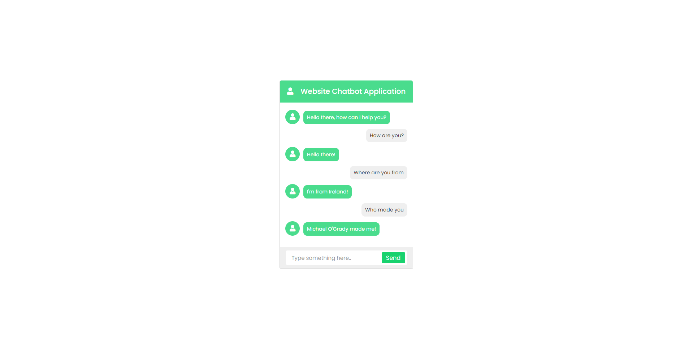

# Website Chatbot Application with PHP and AJAX

Login/Registration with Email Address Verification, Session, OTP Verification and Password Reset, including Password Hashing using PHP and MySQL



### Built with HTML, CSS, PHP, SQL.

### Task List

- [x] Components Design (HTML)
- [x] Styling (CSS)
- [x] Database and Tables Creation
- [x] Creating PHP functions (PHP)

## Installation Instructions

1. Create bot DATABASE on your server (or open Xampp and phpMyAdmin to create the database on localhost).

2. Run the following SQL script to create the required database TABLE:

```
CREATE TABLE chatbot (
id int(11) PRIMARY KEY AUTO_INCREMENT,
queries varchar(300),
replies varchar(300)
);
```

3. You must enter queries and replies in the database so the chatbot can interpet user input and give replies. You can do this
   by clicking the insert tab in phpMyAdmin panel and copying and pasting in greetings like the following into the queries column:

   > Hello! | How are you? | How are you doing? | What’s up? | Tell me something | Ok | Yes | I’ll do that now |

4. Alternatively, run the following script to enter sample queries and replies

```
INSERT INTO `chatbot` (`id`, `queries`, `replies`) VALUES (NULL, 'What color are your shoes | What color are your shoes?', 'Blue and green.'), (NULL, 'I have a problem with my order.', 'What is your account number?'), (NULL, ' I would like the late fee waived.', 'I see we received your payment on the 14th, which is four days past the due date.'), (NULL, ' I want the charges reversed or I will close my account and smear you on social media.', 'I see you’ve been a good customer for a long time. I can take care of reversing that late fee. Give me just a moment.'), (NULL, 'What’s up? | Whats up |', 'Nothing much just having a byte!'), (NULL, 'Good morning | Good morning!', 'Good morning to you too! '), (NULL, 'Good evening | Good Evening!', 'Good evening to you too!'), (NULL, 'Goodnight', 'Goodnight to you too!'), (NULL, 'I’m not feeling well |I’m sad | Im sad ', ' I’m sorry to hear that, How can I help you? '), (NULL, 'Where are you located? | Where are you from? | Where are you from', 'The sticks'), (NULL, 'Are you a real person or a chatbot? | Are you a real person | Are you a real chatbot', 'HAHAHA. I am a real person! Or, am I..?!'), (NULL, 'Who made you | Who made you?', 'Michael O\'Grady made me!'), (NULL, 'Bye | Goodbye | I have to go', 'Ok bye, hope to chat again soon!'), (NULL, 'Where are you from | Where are you from ?', 'I\'m from Ireland!'), (NULL, 'What is your name | What is your name?', 'My name is Website Chat Application!'), (NULL, 'How are you? | Hi | Hello | How are you', 'Hello there!');

```
