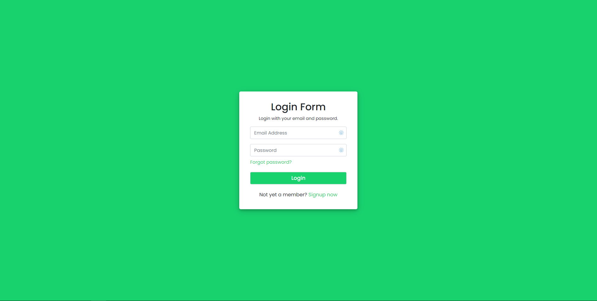

# Backend PHP Login & Registration Application

Login/Registration with Email Address Verification, Session, OTP Verification and Password Reset, including Password Hashing using PHP and MySQL



### Built with HTML, CSS, PHP, SQL.

## Features

- [x] Logout functionality with sessions
- [x] Password hashing
- [x] Serverside validation for user entry errors in email and password fields
- [x] Serverside validation check on database for existing email address in the system
- [x] Sends email to subscriber after successful registration with OTP code to verify email address
- [x] Serverside validation for correct OTP codes for initial registration and forgot password functionality

### Task List

- [x] Components Design (HTML)
- [x] Styling (CSS)
- [x] Database and Tables Creation
- [x] Creating PHP functions (PHP)

## Installation Instructions for Testing on Localhost with Gmail client

#### XAMPP - Go to the XAMPP installation directory and open the XAMPP folder and follow the below steps:

1. Go to the (C:\xampp\php) and open the php.ini or php file then find the mail function by scrolling down or simply press ctrl+f to search directly then find the following lines and pass in these values:

#### PHP.INI FILE:

```
[mail function]
For Win32 only.
http://php.net/smtp
SMTP=smtp.gmail.com
http://php.net/smtp-port
smtp_port=587
sendmail_from = your_email_address_here
sendmail_path = "\"C:\xampp\sendmail\sendmail.exe\" -t"
```

2. Now, go the (C:\xampp\sendmail) and open the sendmail.ini then find sendmail by scrolling down or press ctrl+f to search directly then find the following lines and pass these values:

#### SENDMAIL.INI FILE:

```
smtp_server=smtp.gmail.com
smtp_port=587
error_logfile=error.log
debug_logfile=debug.log
auth_username=your_email_address_here
auth_password=your_password_here
```

3. Save all files and restart Apache Server from the XAMPP Panel and you're ready to go!

4. Open Xampp and phpMyAdmin and create userform DATABASE.

5. Run the following SQL script to create the required database TABLE:

```sql
CREATE TABLE usertable (
id int(11) PRIMARY KEY AUTO_INCREMENT,
name  varchar(255),
email varchar(255),
password  varchar(255),
code  mediumint(50),
status varchar(255)
);
```

6. Ensure to update the $sender variable with your own email address otherwise it will not work.

7. Open the landing page: login-user.php file. Click Signup Now. Enter email address and details and click submit. The email is now sent to your address with the following text:

   > Subject - Email Verification Code.
   > Body - Your verification code is [xxxxxx].

8. Code Verification:

   > Enter the OTP verification code into the input box.

9. User is registered and logged in.
