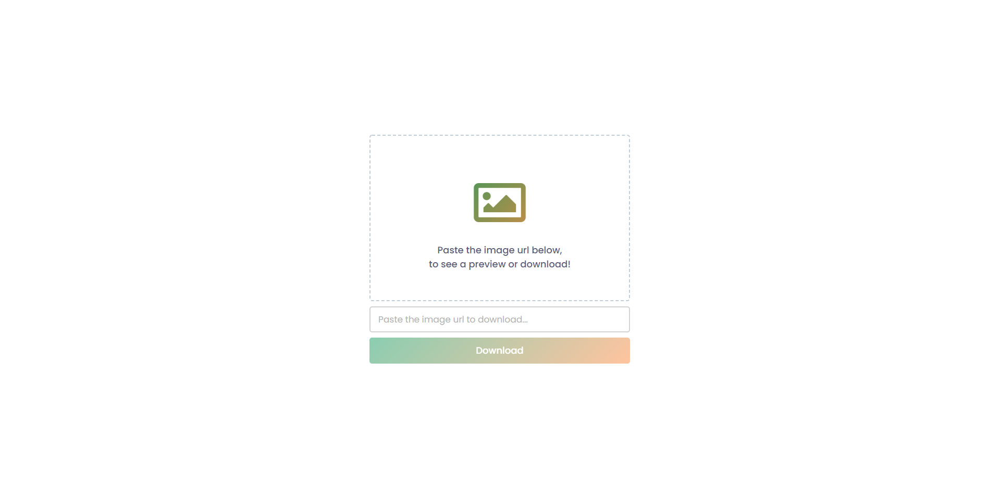
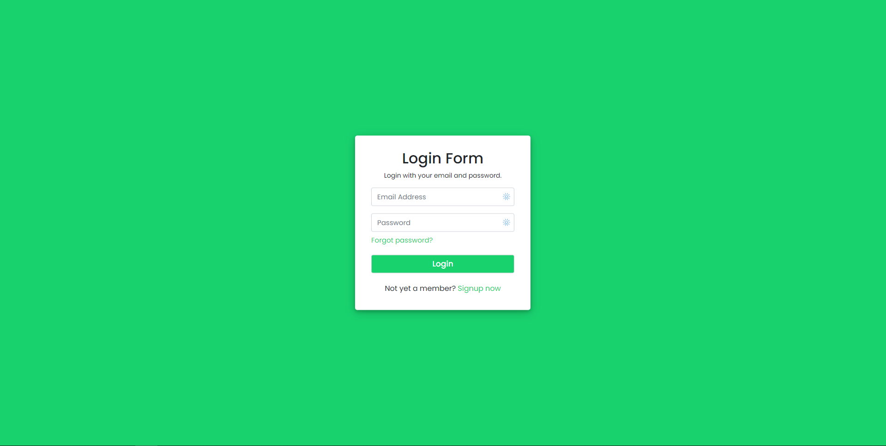
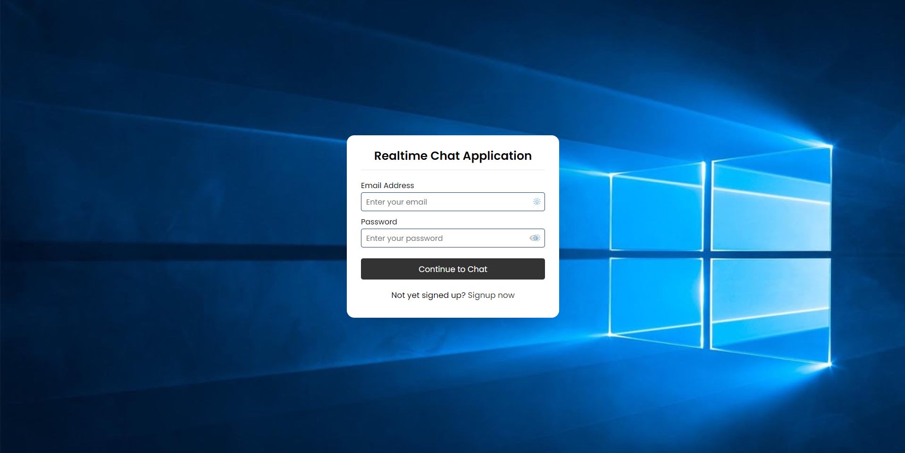
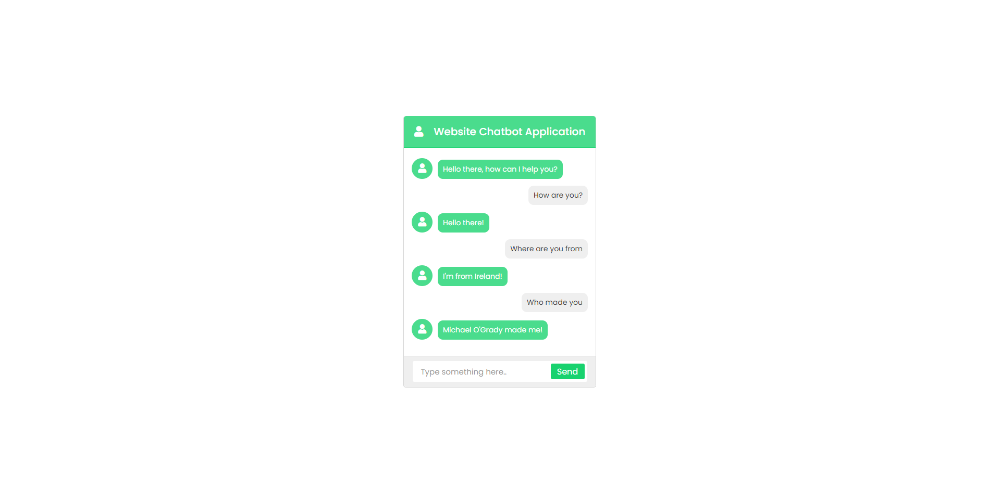

<h1 align="center">PHP Applications</h1>

Small collection of projects in PHP and MySQL within this Repo.

View the `README.md` file in each directory for the projects below.

- [x] [Realtime Chat Application](Real-Time-Chat-Application-PHP-Ajax/README.MD)
- [x] [Chat Application](Chatbot-PHP-AJAX/README.MD)
- [x] [Subscribe Application](Subscribe-Application-PHP/README.MD)
- [x] [Login Registration Application](Login-Registration-Application-PHP/README.MD)
- [x] [Image Upload Application](Backend-Image-Downloader-PHP/README.MD)

Instead, to run these you must download and run locally instead and follow project documentation.

<h1 align="center">
 

</h1>
