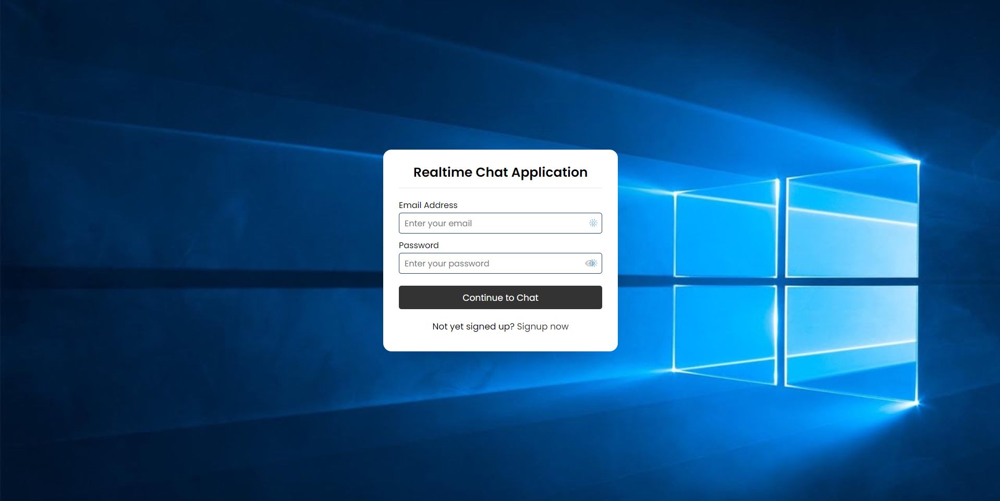

# Backend Real Time Chat Application using PHP, Ajax & mySQL.

### Built with HTML, CSS, PHP, SQL.

### Features

> SQL Injection protected

> Pasword hashed

> PHP Session set when user logs in or signs up, if session is not set, user is redirected to login page

> Queries the database every 3.5s {JavaScript setinterval ~ ajax request} for Real Time updates

### Task List

- [x] Component Design (HTML)
- [x] Styling (CSS)
- [x] Database and Tables Creation
- [x] Creating PHP functions (PHP)
- [x] Creating Ajax Requests for Real Time updates without reloading the browser

## Installation Instructions

1. Create chatapp DATABASE on your server (or open Xampp and phpMyAdmin to create the database on localhost).

2. Run the `chatapp.sql` script to create the required database tables.
